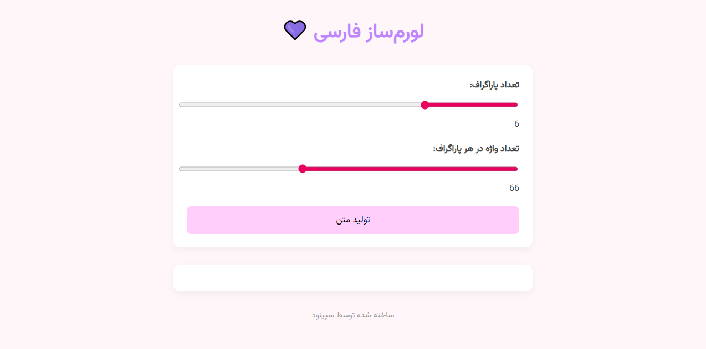

# 🌸 Persian Lorem Generator

A responsive, pastel-themed Persian lorem ipsum generator built with **HTML**, **CSS**, and **vanilla JavaScript**.  
It allows users to generate randomized Persian placeholder text with customizable paragraph and word counts — perfect for designers and developers working on RTL layouts.

## ✨ Features

- Beautiful pastel UI with smooth transitions
- Adjustable number of paragraphs and words per paragraph
- Fully responsive design for desktop and mobile
- Copy-to-clipboard functionality for quick usage
- RTL support with Persian font and styling

## 📸 Preview

## 🚀 Live Demo

👉 [Click here to view the live project](https://sepinoodl.github.io/persian-lorem/)

## 🛠️ Technologies Used

- HTML5
- CSS3 (Flexbox, transitions, media queries)
- JavaScript (ES6)
- Google Fonts: Vazirmatn

## 📁 Folder Structure

├── index.html 
├── styles.css 
├── script.js 
├── persian-lorem-preview.png

## 🧠 About Me

This project was designed and developed by **Sepinood Langari**, a front-end developer passionate about clean UI, RTL-friendly design, and modern web aesthetics. 💜
